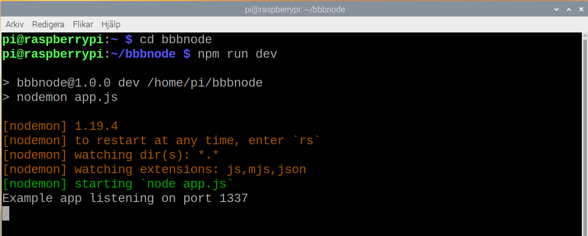
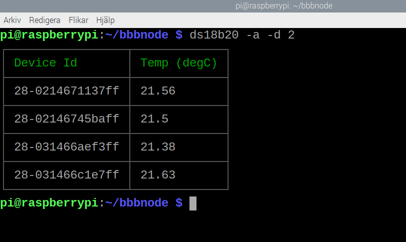
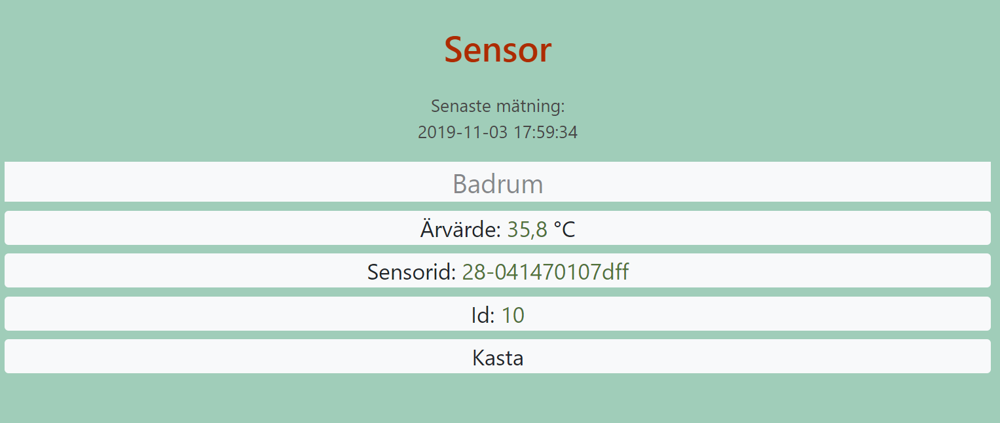
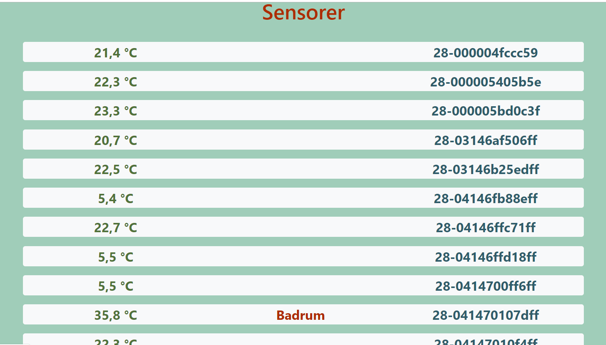
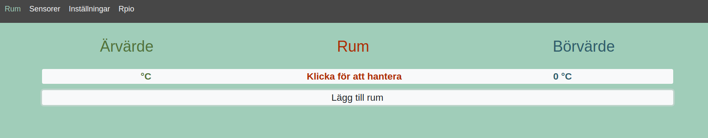
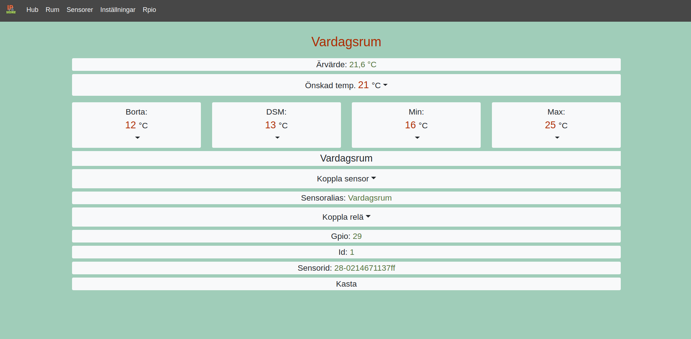
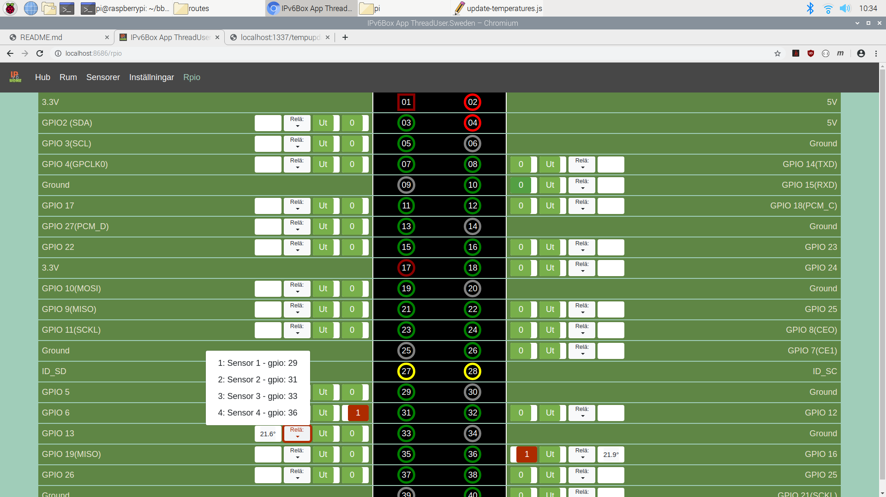
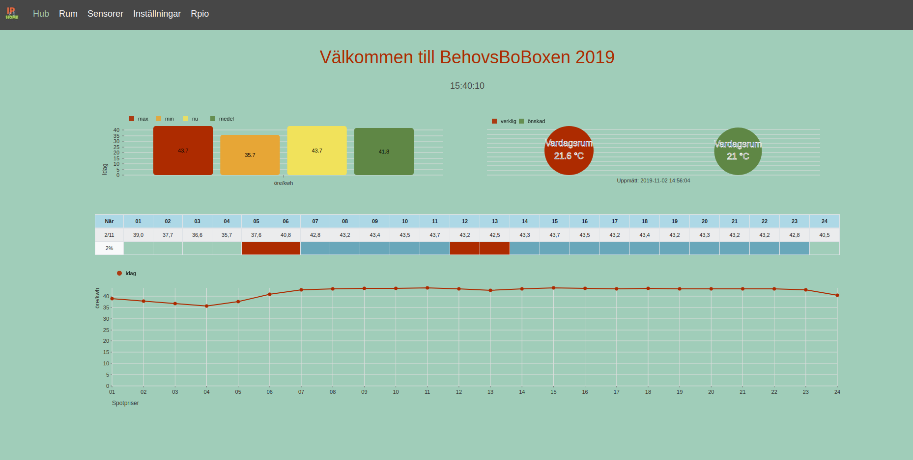

# BehovsBoBoxen<br>Styr effekt i hemmet

[](https://travis-ci.org/guni12/bbbnode) 
[](https://scrutinizer-ci.com/g/guni12/bbbnode/?branch=master) 
[](https://scrutinizer-ci.com/g/guni12/bbbnode/build-status/master) 
[](https://www.codacy.com/app/guni12/bbbnode?utm_source=github.com&amp;utm_medium=referral&amp;utm_content=guni12/bbbnode&amp;utm_campaign=Badge_Grade) 
[](https://coveralls.io/github/guni12/bbbnode?branch=master) 
[](https://codeclimate.com/github/guni12/bbbnode/maintainability)

Mjukvaran för styrsystemet är byggt med Node.js, Express, React och Sqlite3.

## Gör så här

[Materiallista](https://github.com/guni12/bbbnode/blob/master/doc/sensor-init.md#detta-behover-du)  

### 1. Förbered Raspberry Pi

Konfigurera sd-kortet, installera raspbian och konfigurera till svenska förhållanden:  
[https://www.raspberrypi.org/documentation/installation/noobs.md](https://www.raspberrypi.org/documentation/installation/noobs.md)  
* Aktivera ssh.  
* Byt lösenord!!!  
* Aktivera 1-Wire  

För att kunna läsa denna readme-fil i raspbians webbläsare, aktivera chrome-tillägget 'Markdown Viewer'. Aktivera också en 'JSON Viewer', för trevligare läsupplevelse av BehovsBoBoxens API.  
[https://chrome.google.com/webstore/search/json%20viewer](https://chrome.google.com/webstore/search/json%20viewer)  
[https://chrome.google.com/webstore/search/markdown%20viewer](https://chrome.google.com/webstore/search/markdown%20viewer)  
(Googla för ytterligare installations-uppgifter. Bra instruktioner finns.)

### 2. Installera sensorer
[Instruktioner här](doc/sensor-init.md#installera-sensorer)  

### 3. Hämta BehovsBoBoxen
```sh
git clone https://github.com/guni12/bbbnode
```

### 4. Ändra lösenord, användaruppgifter och installera
Öppna filen `/home/pi/bbbnode/scripts/install.sh` och ändra *LååångtLösenord* till ditt eget val (rad 47)  
Ändra i filen `/home/pi/bbbnode/scripts/curls.sh` *din@email.se* och *hemlig* till dina val.  
Öppna en terminal och kör följande kommando - (det kan ta en stund, sqlite ger många varningar, men fungerar):  
```sh
sh /home/pi/bbbnode/scripts/install.sh
```
Efter detta startas systemet om.

### 5. Starta en utvecklings-server
Öppna en egen terminal och kör följande kommandon:  
```sh
cd bbbnode
npm run dev
```
Processen ska rulla under installationen.  



### 6. Initiera BehovsBoBoxen
Öppna en ny terminal och kör filen:
```sh
cd bbbnode
sh /home/pi/bbbnode/scripts/curls.sh
```
Det som händer här är att alla installerade sensorer hittas av systemet.  
En lista med alla relän initieras. Aktuellt spotpris hämtas. Temperaturerna uppdateras och styrning enligt default inställningar räknas ut.  

### 7. Gränssnittet

Gå till hemsidan utan inloggning `http://ditt.ip.n.r:8686`.  

(Det finns två alternativa portnummer till gränssnittet. `:8787` är med inloggning.)  

### 8. Namnge sensorer

Börja med att ge namn till dina sensorer (sidan *Sensorer*) allteftersom du identifierar dem. 


Du kan värma sensorerna i handen och använda `http://ditt.ip.n.r:1337/tempupdate` för att uppdatera värdena.  

Alternativt använd terminalen direkt med kommandot `ds18b20 -a -d 2`.  


Uppdatera sidan *Sensorer* och klicka på den hittade sensorn.  


Ge den ett alias, så du lättare kan hålla reda på den.  


### 9. Skapa rum

På sidan *Rum* kan man välja de sensorer som man vill ska styra relän.  


Namnge rummet och välj sensor, respektive relä i varsin dropdown-lista. Här ställer du också in önskade temperaturer.  


På sidan *Rpio* kan du se dina aktiva relän.  


På hem-sidan *Hub* finns dags-info om priser mm.  


### 10. Läsa temperaturer och uppdatera värden

När du är nöjd med ovanstående är det dags att installera några kommandon som körs regelbundet via cron. Om du vill ändra hur ofta uppdateringar körs, är det här du ska gå in och ändra (med `sudo crontab -e`).
```sh
sudo crontab -l -u root |  cat /home/pi/bbbnode/scripts/cron.txt | sudo crontab -u root -
```

### 11. Starta en production server
Det är också bra att avsluta development-server-processen (ctrl + c) och starta en pm2 process som sedan startar om automatiskt vid reboot eller strömavbrott.

```sh
cd bbbnode
sudo fuser -k 1337/tcp
pm2 start npm -- start
```

### 12. Användbara kommandon

För att läsa temperaturerna direkt i terminalen, skriv:
```sh
ds18b20 -a -d 2
```

För att se eller döda processer
```sh
sudo lsof -i -P -n | grep LISTEN
sudo lsof -i :1337
sudo fuser -k 1337/tcp
```
För att se pm2 respektive döda den installerade processen och starta om.  
Även en process som startar om vid förändring i koden (för den som själv utvecklar koden)
```sh
pm2 log
pm2 delete npm
pm2 show npm
pm2 start npm -- start
pm2 start npm -- start --watch --ignore-watch="node_modules"
```

### 13. Port forwarding

För att använda hemsidan från fjärr behövs port forwarding och det är två portar som behöver öppnas, både port 1337 och antingen 8686 (utan inloggning) eller 8787 (med inloggning).

## API 
### `http://ditt.ip.n.r:1337`

| Sökväg                | Uträttar                                              |
|-----------------------|-------------------------------------------------------|
| (GET)                 |                                                       |
| /                     | Testsida                                              |
| /savesensors          | Hittar och sparar nya sensorer till databasen         |
| /showsensors          | Visar de sparade senorerna med ev alias               |
| /showsensors/id(int)  | Visar sensor med id                                   |
| /deletesensor/id(int) | Tar bort sensor med id                                |
| /initgpios            | Initierar gpio-pinnarna till databasen                |
| /showgpios            | Visar de sparade gpio-pinnarna från databasen         |
| /showgpios/id(int)    | Visar gpio-pinne med id                               |
| /settings             | Visar inställda värden                                |
| /spotcal              | Plockar ut dagens spotpriser enligt settings          |
| /spotcal/2            | Plockar ut morgondagens spotpriser, om efter kl.16    |
| /today                | Visar dagens utvunna spotprislista enligt settings    |
| /today2               | Visar morgondagens utvunna spotprislista              |
| /addroom              | Lägger till rum om kopplad sensor finns               |
| /rooms                | Visar info om tillagda rum                            |
| /rooms/id(int)        | Visar info om rum (id)                                |
| /deleteroom/id(int)   | Tar bort rum med id                                   |
| /roomssensors         | Visar all rum med kopplad sensor                      |
| /roomssensors/id(int) | Visar rum med kopplad sensor (rum-id)                 |
| /controlupdate        | Räknar ut styrning enligt spotpris                    |
| /controls             | Visar kontroll-inställningarna                        |
| /hourcontrol          | Ställer in styrning, inställd att köras var 10e minut |
| /tempupdate           | Läser av gpio-sensorerna och uppdaterar zonerna       |
| (POST)                |                                                       |
| /login                | Inloggning som skapar en tidsbegränsad token          |
| /register             | Skapa ny medlem (email, password) i tabell *'user'*   |
| /editroom             | Uppdatera *'room'* med ett nytt värde                 |
| /editsettings         | Uppdatera *'settings'* med ett nytt värde             |
| /editgpio             | Uppdatera *'gpios'* med (mode, status)                |
| /editsensor           | Uppdatera *'sensors'* med (namn, temp, gpio, rum)     |