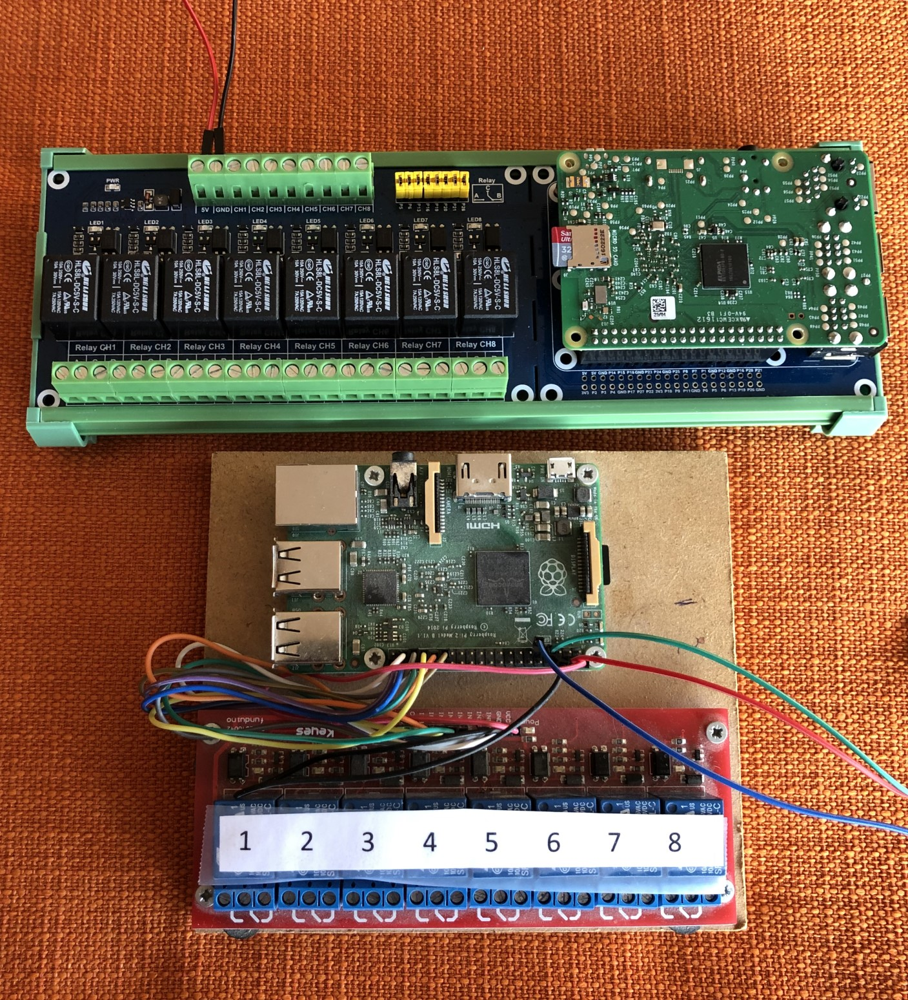

# Materiallista och Instruktioner för att installera relän:

[Tillbaka till README](../README.md#behovsboboxen)  

## Detta behöver du

| Bom | Antal    | Materiallista                       | Antal    | Materiallista                     |
|---- | -------- | ----------------------------------- | ---------|---------------------------------- |
|     |          | **BehovsBoBoxen 2019**              |          | **BehovsBoBoxen 2017**            |
| 1   | 1        | Raspberry pi 3 modell B             | 1        | Raspberry pi 3 modell B           |
| 2   | &#8805;2 | ds18b20 (1-wire eller dallas)       | &#8805;2 | ds18b20 (1-wire eller dallas)     |
| 3   | 1        | micro SD kort, gärna minst 32GB     | 1        | micro SD kort, gärna minst 32GB   |
| 4   | 1        | [påhängskort](#installera-sensorer) | 1        | reläkort med 8 relän              |
| 5   | 1        | 5V 3A USB laddare                   | 1        | 5V 3A USB laddare                 |
| 6   |          |                                     | 1        | knippe kopplingssladdar           |
| 7   | 1        | Ethernetsladd                       | 1        | Ethernetsladd                     |

## Raspberry Pi

Konfigurera sd-kortet, installera raspbian och konfigurera till svenska förhållanden:  
[https://www.raspberrypi.org/documentation/installation/noobs.md](https://www.raspberrypi.org/documentation/installation/noobs.md)  
* Aktivera ssh.  
* Byt lösenord!!!  
* Aktivera 1-Wire  

#### Tips!
* Aktivera en 'JSON Viewer', för trevligare läsupplevelse av BehovsBoBoxens API.  
[https://chrome.google.com/webstore/search/json%20viewer](https://chrome.google.com/webstore/search/json%20viewer)  
* För att kunna läsa lokala md-filer, t.ex. denna readme-fil i raspbians webbläsare, aktivera chrome-tillägget 'Markdown Viewer':
[https://chrome.google.com/webstore/search/markdown%20viewer](https://chrome.google.com/webstore/search/markdown%20viewer)  
1. Gå sedan till [chrome://extensions](chrome://extensions)
2. Hitta Markdown Viewer and klicka på `info` knappen
3. Se till att `Tillåt åtkomst till webbadresser i filen` är på  

## Installera sensorer och reläkort

På bilden ovan pekar de röda pilarna på plus och de blå pilarna på minus. De vita pilarna pekar på signal.

### BehovsBoBoxen 2017 har ett löst reläkort som kopplas med så kallade dupontsladdar  
Koppla relä nr 1 - 8 (se den gröna pilen) från pinne 29,31,33,36,35,38,40,37.  
Koppla plus från pinne 2 eller 4 och minus från pinne 6, 9,14,25,30,34 eller 39.  
Koppla in ”dallasgivarna” till plus och minus, samt signalen till pinne 7.  

### För BehovsBoBoxen 2019 har vi valt att köpa ett påhängskort från Hi-tech chain  
[https://hitechchain.se/raspberry-pi/raspberry-pi-8-ch-relay-expansion-board](https://hitechchain.se/raspberry-pi/raspberry-pi-8-ch-relay-expansion-board)  
Koppla in dallasgivarna på skruvplintarna till plus och minus samt tryck eller löd fast signalen på hål P4.  

[Tillbaka till README](../README.md#behovsboboxen)  